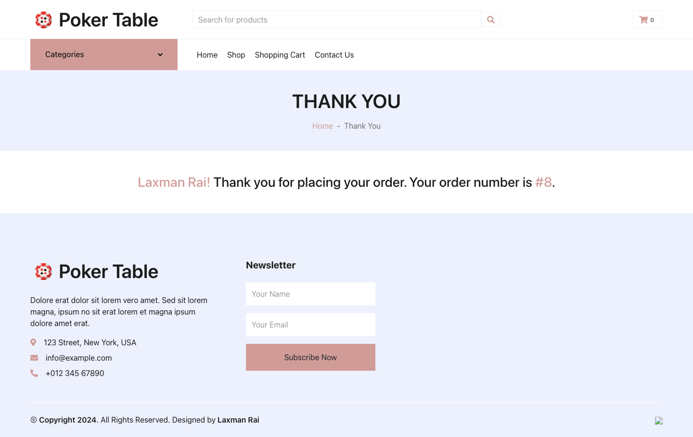

# Prerequisites
Node version - v18.18.1
MySQL - 8.0.37

# Clone Repository

https://github.com/laxman7488/Ecomm-React-Redux-Nodejs-MySQL-Sequelize.git

## Install package dependencies
cd client && npm install
cd server && npm install

## Configure MySQL database
/server/config/dev.env - hostname, port, username and password

## Start Frontend and Backend server
cd client && npm start
cd server && npm start

## Usage
- Access the React application by visiting `http://localhost:3000` in your web browser.
- The Node.js API endpoints are accessible at `http://localhost:8080`.

## Screenshots

## Contributing
Contributions are welcome! If you find any bugs or have suggestions for improvement, please open an issue or create a pull request.
## Author
Laxman Rai

## License
[MIT License](LICENSE)
